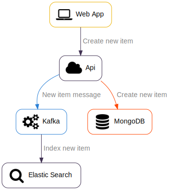
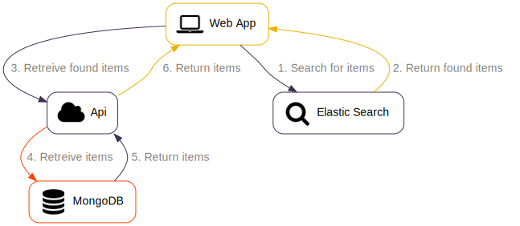

# Elasticsearch Architecture

- [Overview](#overview)
- [Index Elasticsearch Documents](#index-elasticsearch-documents)
- [Search Elasticsearch Documents](#search-elasticsearch-documents)

## Overview

This document describes an application architecture that leverages Elasticsearch.

## Index Elasticsearch documents

Elasticsearch documents are created/updated by Kafka anytime a change is detected by the API.

## Search Elasticsearch documents

Elasticsearch documents are searched by the web application.

