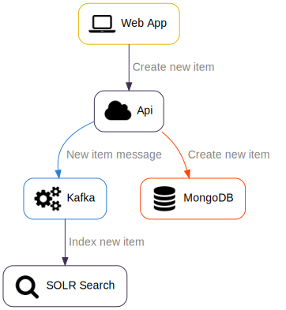

# SOLR Architecture

- [Overview](#overview)
- [Index SOLR Documents](#index-solr-documents)
- [Search SOLR Documents](#search-solr-documents)

## Overview

This document describes an application architecture that leverages SOLR.

## Index SOLR documents

SOLR documents are created/updated by Kafka anytime a change is detected by the API.

## Search SOLR documents

SOLR documents are searched by the web application.

